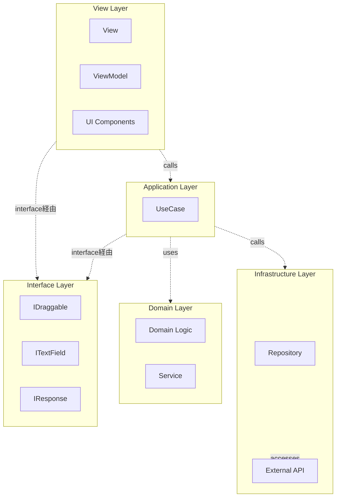
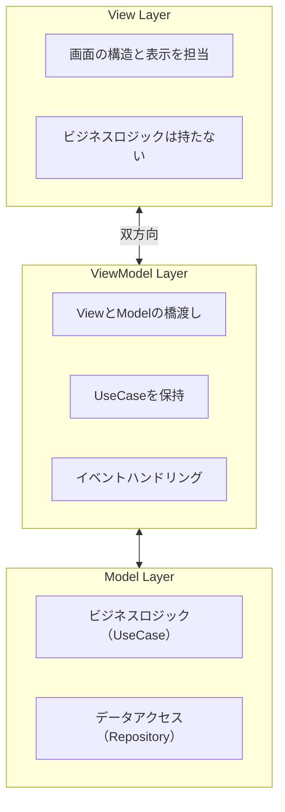
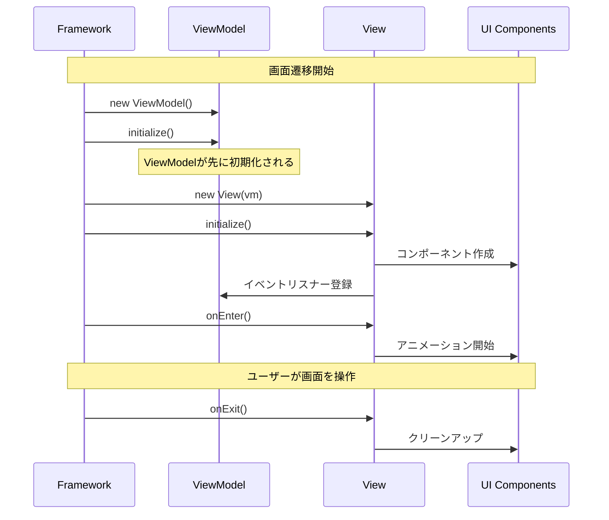

# Next2D Framework Specs - 統合リファレンス

## 目次

1. [Index - フレームワーク概要](#index---フレームワーク概要)
2. [AnimationTool連携](#animationtool連携)
3. [設定ファイル](#設定ファイル)
4. [ルーティング](#ルーティング)
5. [View と ViewModel](#view-と-viewmodel)

---
# Next2D Framework

Next2D Frameworkは、Next2D Playerを用いたアプリケーション開発のためのMVVMフレームワークです。シングルページアプリケーション（SPA）のためのルーティング、View/ViewModel管理、環境設定管理などの機能を提供します。

## 主な特徴

- **MVVMパターン**: Model-View-ViewModelパターンによる関心の分離
- **クリーンアーキテクチャ**: 依存性の逆転と疎結合な設計
- **シングルページアプリケーション**: URLベースのシーン管理
- **Animation Tool連携**: Animation Toolで作成したアセットとの連携
- **TypeScriptサポート**: 型安全な開発が可能
- **アトミックデザイン**: 再利用可能なコンポーネント設計を推奨

## アーキテクチャ概要

このプロジェクトはクリーンアーキテクチャとMVVMパターンを組み合わせて実装されています。



### レイヤーの責務

| レイヤー | パス | 役割 |
|----------|------|------|
| **View** | `view/*`, `ui/*` | 画面の構造と表示を担当 |
| **ViewModel** | `view/*` | ViewとModelの橋渡し、イベントハンドリング |
| **Interface** | `interface/*` | 抽象化レイヤー、型定義 |
| **Application** | `model/application/*/usecase/*` | ビジネスロジックの実装（UseCase） |
| **Domain** | `model/domain/*` | コアビジネスルール |
| **Infrastructure** | `model/infrastructure/repository/*` | データアクセス、外部API連携 |

### 依存関係の方向

クリーンアーキテクチャの原則に従い、依存関係は常に内側（Domain層）に向かいます。

- **View層**: インターフェースを通じてApplication層を使用
- **Application層**: インターフェースを通じてDomain層とInfrastructure層を使用
- **Domain層**: 何にも依存しない（純粋なビジネスロジック）
- **Infrastructure層**: Domain層のインターフェースを実装

## ディレクトリ構造

```
my-app/
├── src/
│   ├── config/                    # 設定ファイル
│   │   ├── stage.json             # ステージ設定
│   │   ├── config.json            # 環境設定
│   │   ├── routing.json           # ルーティング設定
│   │   └── Config.ts              # 設定の型定義とエクスポート
│   │
│   ├── interface/                 # インターフェース定義
│   │   ├── IDraggable.ts          # ドラッグ可能なオブジェクト
│   │   ├── ITextField.ts          # テキストフィールド
│   │   ├── IHomeTextResponse.ts   # APIレスポンス型
│   │   └── IViewName.ts           # 画面名の型定義
│   │
│   ├── view/                      # View & ViewModel
│   │   ├── top/
│   │   │   ├── TopView.ts         # 画面の構造定義
│   │   │   └── TopViewModel.ts    # ビジネスロジックとの橋渡し
│   │   └── home/
│   │       ├── HomeView.ts
│   │       └── HomeViewModel.ts
│   │
│   ├── model/
│   │   ├── application/           # アプリケーション層
│   │   │   ├── top/
│   │   │   │   └── usecase/
│   │   │   │       └── NavigateToViewUseCase.ts
│   │   │   └── home/
│   │   │       └── usecase/
│   │   │           ├── StartDragUseCase.ts
│   │   │           ├── StopDragUseCase.ts
│   │   │           └── CenterTextFieldUseCase.ts
│   │   │
│   │   ├── domain/                # ドメイン層
│   │   │   └── callback/
│   │   │       ├── Background.ts
│   │   │       └── Background/
│   │   │           └── service/
│   │   │               ├── BackgroundDrawService.ts
│   │   │               └── BackgroundChangeScaleService.ts
│   │   │
│   │   └── infrastructure/        # インフラ層
│   │       └── repository/
│   │           └── HomeTextRepository.ts
│   │
│   ├── ui/                        # UIコンポーネント
│   │   ├── animation/             # アニメーション定義
│   │   │   └── top/
│   │   │       └── TopBtnShowAnimation.ts
│   │   │
│   │   ├── component/             # アトミックデザイン
│   │   │   ├── atom/              # 最小単位のコンポーネント
│   │   │   │   ├── ButtonAtom.ts
│   │   │   │   └── TextAtom.ts
│   │   │   ├── molecule/          # Atomを組み合わせたコンポーネント
│   │   │   │   ├── HomeBtnMolecule.ts
│   │   │   │   └── TopBtnMolecule.ts
│   │   │   ├── organism/          # 複数Moleculeの組み合わせ
│   │   │   ├── template/          # ページテンプレート
│   │   │   └── page/              # ページコンポーネント
│   │   │       ├── top/
│   │   │       │   └── TopPage.ts
│   │   │       └── home/
│   │   │           └── HomePage.ts
│   │   │
│   │   └── content/               # Animation Tool生成コンテンツ
│   │       ├── TopContent.ts
│   │       └── HomeContent.ts
│   │
│   ├── assets/                    # 静的アセット
│   │
│   ├── Packages.ts                # パッケージエクスポート
│   └── index.ts                   # エントリーポイント
│
├── file/                          # Animation Tool出力ファイル
│   └── sample.n2d
│
├── mock/                          # モックデータ
│   ├── api/                       # APIモック
│   ├── content/                   # コンテンツモック
│   └── img/                       # 画像モック
│
└── package.json
```

## フレームワークフローチャート

gotoView関数による画面遷移の詳細なフローを示します。

```mermaid
graph TD
    User([User]) -->|Request| GotoView[gotoView Path]

    GotoView --> LoadingCheck{use loading?<br/>Default: true}

    LoadingCheck -->|YES| ScreenOverlay[Screen Overlay]
    LoadingCheck -->|NO| RemoveResponse
    ScreenOverlay --> LoadingStart[Start Loading]
    LoadingStart --> RemoveResponse

    RemoveResponse[Remove Previous Response Data] --> ParseQuery[Parse Query String]
    ParseQuery --> UpdateHistory{SPA mode?}

    UpdateHistory -->|YES| PushState[Push History State]
    UpdateHistory -->|NO| RequestType
    PushState --> RequestType

    RequestType[Request Type]

    RequestType --> JSON[JSON: Get external JSON data]
    RequestType --> CONTENT[CONTENT: Get Animation Tool JSON]
    RequestType --> CUSTOM[CUSTOM: Request to external API]

    JSON --> CacheCheck{use cache?<br/>Default: false}
    CONTENT --> CacheCheck
    CUSTOM --> CacheCheck

    CacheCheck -->|YES| CacheData[(Cache)]
    CacheCheck -->|NO| GlobalData{{Global Network}}

    CacheData --> Cached{Cached?}

    Cached -->|NO| GlobalData
    Cached -->|YES| RegisterResponse
    GlobalData --> RegisterResponse

    RegisterResponse[Register Response Data] --> RequestCallback{request callback?}

    RequestCallback -->|YES| ExecRequestCallback[Execute Request Callback]
    RequestCallback -->|NO| UnbindView
    ExecRequestCallback --> UnbindView

    UnbindView[Previous View: onExit & Unbind] --> BindView[New View/ViewModel: Bind]
    BindView --> ViewModelInit[ViewModel: initialize]

    ViewModelInit --> ViewInit[View: initialize]
    ViewInit --> AddToStage[Add View to Stage]
    AddToStage --> GotoViewCallback{gotoView callback?}

    GotoViewCallback -->|YES| ExecGotoViewCallback[Execute gotoView Callback]
    GotoViewCallback -->|NO| LoadingEndCheck
    ExecGotoViewCallback --> LoadingEndCheck

    LoadingEndCheck{use loading?<br/>Default: true}

    LoadingEndCheck -->|YES| LoadingEnd[End Loading]
    LoadingEndCheck -->|NO| OnEnter
    LoadingEnd --> DisposeOverlay[Dispose Screen Overlay]
    DisposeOverlay --> OnEnter

    OnEnter[View: onEnter] --> StartDrawing

    StartDrawing[Start Drawing] -->|Response| User

    style User fill:#d5e8d4,stroke:#82b366
    style StartDrawing fill:#dae8fc,stroke:#6c8ebf
    style CacheData fill:#fff2cc,stroke:#d6b656
    style GlobalData fill:#f5f5f5,stroke:#666666
```



### フローの主要ステップ

| ステップ | 説明 |
|----------|------|
| **gotoView** | 画面遷移のエントリーポイント |
| **Loading** | ローディング画面の表示/非表示制御 |
| **Request Type** | JSON、CONTENT、CUSTOMの3種類のリクエスト |
| **Cache** | レスポンスデータのキャッシュ制御 |
| **View/ViewModel Bind** | 新しいView/ViewModelのバインド処理 |
| **onEnter** | 画面表示完了後のコールバック |

## 主要な設計パターン

### 1. MVVM (Model-View-ViewModel)

- **View**: 画面の構造と表示を担当。ビジネスロジックは持たない
- **ViewModel**: ViewとModelの橋渡し。UseCaseを保持し、イベントを処理
- **Model**: ビジネスロジックとデータアクセスを担当

### 2. UseCaseパターン

各ユーザーアクションに対して、専用のUseCaseクラスを作成:

```typescript
export class StartDragUseCase
{
    execute(target: IDraggable): void
    {
        target.startDrag();
    }
}
```

### 3. 依存性の逆転 (Dependency Inversion)

具象クラスではなく、インターフェースに依存:

```typescript
// 良い例: インターフェースに依存
import type { IDraggable } from "@/interface/IDraggable";

function startDrag(target: IDraggable): void
{
    target.startDrag();
}
```

### 4. Repositoryパターン

データアクセスを抽象化し、エラーハンドリングも実装:

```typescript
export class HomeTextRepository
{
    static async get(): Promise<IHomeTextResponse>
    {
        try {
            const response = await fetch(`${config.api.endPoint}api/home.json`);
            if (!response.ok) {
                throw new Error(`HTTP error! status: ${response.status}`);
            }
            return await response.json();
        } catch (error) {
            console.error("Failed to fetch:", error);
            throw error;
        }
    }
}
```

## クイックスタート

### プロジェクトの作成

```bash
npx create-next2d-app my-app
cd my-app
npm install
npm start
```

### View/ViewModelの自動生成

```bash
npm run generate
```

このコマンドは`routing.json`のトッププロパティを解析し、対応するViewとViewModelクラスを生成します。

## ベストプラクティス

1. **インターフェース優先**: 具象型ではなく、常にインターフェースに依存
2. **単一責任の原則**: 各クラスは1つの責務のみを持つ
3. **依存性注入**: コンストラクタで依存を注入
4. **エラーハンドリング**: Repository層で適切にエラーを処理
5. **型安全性**: `any`型を避け、明示的な型定義を使用

## 関連ドキュメント

### 基本
- [View/ViewModel](/ja/reference/framework/view) - 画面表示とデータバインディング
- [ルーティング](/ja/reference/framework/routing) - URLベースの画面遷移
- [設定ファイル](/ja/reference/framework/config) - 環境設定とステージ設定
- [Animation Tool連携](/ja/reference/framework/animation-tool) - Animation Toolアセットの活用

### Next2D Player連携
- [Next2D Player](/ja/reference/player) - レンダリングエンジン
- [MovieClip](/ja/reference/player/movie-clip) - タイムラインアニメーション
- [イベントシステム](/ja/reference/player/events) - ユーザーインタラクション

---

# AnimationTool連携

Next2D FrameworkはAnimationToolで作成したアセットとシームレスに連携できます。

## 概要

AnimationToolは、Next2D Player用のアニメーションやUIコンポーネントを作成するためのツールです。出力されたJSONファイルをフレームワークで読み込み、MovieClipとして利用できます。

## ディレクトリ構成

```
src/
├── ui/
│   ├── content/              # Animation Tool生成コンテンツ
│   │   ├── TopContent.ts
│   │   └── HomeContent.ts
│   │
│   ├── component/            # Atomic Designコンポーネント
│   │   ├── atom/             # 最小単位のコンポーネント
│   │   │   ├── ButtonAtom.ts
│   │   │   └── TextAtom.ts
│   │   ├── molecule/         # Atomを組み合わせたコンポーネント
│   │   │   ├── TopBtnMolecule.ts
│   │   │   └── HomeBtnMolecule.ts
│   │   ├── organism/         # 複数Moleculeの組み合わせ
│   │   ├── template/         # ページテンプレート
│   │   └── page/             # ページコンポーネント
│   │       ├── top/
│   │       │   └── TopPage.ts
│   │       └── home/
│   │           └── HomePage.ts
│   │
│   └── animation/            # コードアニメーション定義
│       └── top/
│           └── TopBtnShowAnimation.ts
│
└── file/                     # Animation Tool出力ファイル
    └── sample.n2d
```

## MovieClipContent

Animation Toolで作成したコンテンツをラップするクラスです。

### 基本構造

```typescript
import { MovieClipContent } from "@next2d/framework";

/**
 * @see file/sample.n2d
 */
export class TopContent extends MovieClipContent
{
    /**
     * Animation Tool上で設定したシンボル名を返す
     */
    get namespace(): string
    {
        return "TopContent";
    }
}
```

### namespaceの役割

`namespace`プロパティは、Animation Toolで作成したシンボルの名前と一致させます。この名前を使って、読み込まれたJSONデータから対応するMovieClipが生成されます。

## コンテンツの読み込み

### routing.jsonでの設定

Animation ToolのJSONファイルは`routing.json`の`requests`で読み込みます。

```json
{
    "@sample": {
        "requests": [
            {
                "type": "content",
                "path": "{{ content.endPoint }}content/sample.json",
                "name": "MainContent",
                "cache": true
            }
        ]
    },
    "top": {
        "requests": [
            {
                "type": "cluster",
                "path": "@sample"
            }
        ]
    }
}
```

#### request設定

| プロパティ | 型 | 説明 |
|-----------|------|------|
| `type` | string | `"content"` を指定 |
| `path` | string | JSONファイルへのパス |
| `name` | string | レスポンスに登録されるキー名 |
| `cache` | boolean | キャッシュするかどうか |

#### cluster機能

`@`で始まるキーはクラスターとして定義され、複数のルートで共有できます。`type: "cluster"`で参照します。

```json
{
    "@common": {
        "requests": [
            {
                "type": "content",
                "path": "{{ content.endPoint }}common.json",
                "name": "CommonContent",
                "cache": true
            }
        ]
    },
    "top": {
        "requests": [
            { "type": "cluster", "path": "@common" }
        ]
    },
    "home": {
        "requests": [
            { "type": "cluster", "path": "@common" }
        ]
    }
}
```

## 関連項目

- [View/ViewModel](/ja/reference/framework/view)
- [ルーティング](/ja/reference/framework/routing)
- [設定ファイル](/ja/reference/framework/config)

---

# 設定ファイル

Next2D Frameworkの設定は3つのJSONファイルで管理します。

## ファイル構成

```
src/config/
├── stage.json     # 表示領域の設定
├── config.json    # 環境設定
└── routing.json   # ルーティング設定
```

## stage.json

表示領域（Stage）の設定を行うJSONファイルです。

```json
{
    "width": 1920,
    "height": 1080,
    "fps": 60,
    "options": {
        "fullScreen": true,
        "tagId": null,
        "bgColor": "transparent"
    }
}
```

### プロパティ

| プロパティ | 型 | デフォルト | 説明 |
|-----------|------|----------|------|
| `width` | number | 240 | 表示領域の幅 |
| `height` | number | 240 | 表示領域の高さ |
| `fps` | number | 60 | 1秒間に何回描画するか（1〜60） |
| `options` | object | null | オプション設定 |

### options設定

| プロパティ | 型 | デフォルト | 説明 |
|-----------|------|----------|------|
| `fullScreen` | boolean | false | Stageで設定した幅と高さを超えて画面全体に描画 |
| `tagId` | string | null | IDを指定すると、指定したIDのエレメント内で描画を行う |
| `bgColor` | string | "transparent" | 背景色を16進数で指定。デフォルトは無色透明 |

## config.json

環境ごとの設定を管理するファイルです。`local`、`dev`、`stg`、`prd`、`all`と区切られており、`all`以外は任意の環境名です。

```json
{
    "local": {
        "api": {
            "endPoint": "http://localhost:3000/"
        },
        "content": {
            "endPoint": "http://localhost:5500/"
        }
    },
    "dev": {
        "api": {
            "endPoint": "https://dev-api.example.com/"
        }
    },
    "prd": {
        "api": {
            "endPoint": "https://api.example.com/"
        }
    },
    "all": {
        "spa": true,
        "defaultTop": "top",
        "loading": {
            "callback": "Loading"
        },
        "gotoView": {
            "callback": ["callback.Background"]
        }
    }
}
```

### all設定

`all`はどの環境でも書き出される共通変数です。

| プロパティ | 型 | デフォルト | 説明 |
|-----------|------|----------|------|
| `spa` | boolean | true | Single Page ApplicationとしてURLでシーンを制御 |
| `defaultTop` | string | "top" | ページトップのView。設定がない場合はTopViewクラスが起動 |
| `loading.callback` | string | Loading | ローディング画面のクラス名。start関数とend関数を呼び出す |
| `gotoView.callback` | string \| array | ["callback.Background"] | gotoView完了後のコールバッククラス |

### platform設定

ビルド時の`--platform`で指定した値がセットされます。

対応値: `macos`, `windows`, `linux`, `ios`, `android`, `web`

```typescript
import { config } from "@/config/Config";

if (config.platform === "ios") {
    // iOS固有の処理
}
```

## routing.json

ルーティングの設定ファイルです。詳細は[ルーティング](/ja/reference/framework/routing)を参照してください。

```json
{
    "top": {
        "requests": [
            {
                "type": "json",
                "path": "{{api.endPoint}}api/top.json",
                "name": "TopText"
            }
        ]
    },
    "home": {
        "requests": []
    }
}
```

## 設定値の取得

コード内で設定値を取得するには`config`オブジェクトを使用します。

### Config.tsの例

```typescript
import stageJson from "./stage.json";
import configJson from "./config.json";

interface IStageConfig {
    width: number;
    height: number;
    fps: number;
    options: {
        fullScreen: boolean;
        tagId: string | null;
        bgColor: string;
    };
}

interface IConfig {
    stage: IStageConfig;
    api: {
        endPoint: string;
    };
    content: {
        endPoint: string;
    };
    spa: boolean;
    defaultTop: string;
    platform: string;
}

export const config: IConfig = {
    stage: stageJson,
    ...configJson
};
```

### 使用例

```typescript
import { config } from "@/config/Config";

// ステージ設定
const stageWidth = config.stage.width;
const stageHeight = config.stage.height;

// API設定
const apiEndPoint = config.api.endPoint;

// SPA設定
const isSpa = config.spa;
```

## ローディング画面

`loading.callback`で設定したクラスの`start`関数と`end`関数が呼び出されます。

```typescript
export class Loading
{
    private shape: Shape;

    constructor()
    {
        this.shape = new Shape();
        // ローディング表示の初期化
    }

    start(): void
    {
        // ローディング開始時の処理
        stage.addChild(this.shape);
    }

    end(): void
    {
        // ローディング終了時の処理
        this.shape.remove();
    }
}
```

## gotoViewコールバック

`gotoView.callback`で設定したクラスの`execute`関数が呼び出されます。複数のクラスを配列で設定でき、async/awaitで順次実行されます。

```typescript
import { app } from "@next2d/framework";
import { Shape, stage } from "@next2d/display";

export class Background
{
    public readonly shape: Shape;

    constructor()
    {
        this.shape = new Shape();
    }

    execute(): void
    {
        const context = app.getContext();
        const view = context.view;
        if (!view) return;

        // 背景を最背面に配置
        view.addChildAt(this.shape, 0);
    }
}
```

## ビルドコマンド

環境を指定してビルド:

```bash
# ローカル環境
npm run build -- --env=local

# 開発環境
npm run build -- --env=dev

# 本番環境
npm run build -- --env=prd
```

プラットフォームを指定:

```bash
npm run build -- --platform=web
npm run build -- --platform=ios
npm run build -- --platform=android
```

## 設定例

### 完全な設定ファイルの例

#### stage.json

```json
{
    "width": 1920,
    "height": 1080,
    "fps": 60,
    "options": {
        "fullScreen": true,
        "tagId": null,
        "bgColor": "#1461A0"
    }
}
```

#### config.json

```json
{
    "local": {
        "api": {
            "endPoint": "http://localhost:3000/"
        },
        "content": {
            "endPoint": "http://localhost:5500/mock/content/"
        }
    },
    "dev": {
        "api": {
            "endPoint": "https://dev-api.example.com/"
        },
        "content": {
            "endPoint": "https://dev-cdn.example.com/content/"
        }
    },
    "prd": {
        "api": {
            "endPoint": "https://api.example.com/"
        },
        "content": {
            "endPoint": "https://cdn.example.com/content/"
        }
    },
    "all": {
        "spa": true,
        "defaultTop": "top",
        "loading": {
            "callback": "Loading"
        },
        "gotoView": {
            "callback": ["callback.Background"]
        }
    }
}
```

## 関連項目

- [ルーティング](/ja/reference/framework/routing)
- [View/ViewModel](/ja/reference/framework/view)

---

# ルーティング

Next2D FrameworkはシングルページアプリケーションとしてURLでシーンを制御できます。ルーティングは`routing.json`で設定します。

## 基本設定

ルーティングのトッププロパティは英数字とスラッシュが使用できます。スラッシュをキーにCamelCaseでViewクラスにアクセスします。

```json
{
    "top": {
        "requests": []
    },
    "home": {
        "requests": []
    },
    "quest/list": {
        "requests": []
    }
}
```

上記の場合:
- `top` → `TopView`クラス
- `home` → `HomeView`クラス
- `quest/list` → `QuestListView`クラス

## ルート定義

### 基本的なルート

```json
{
    "top": {
        "requests": []
    }
}
```

アクセス: `https://example.com/` または `https://example.com/top`

### セカンドレベルプロパティ

| プロパティ | 型 | デフォルト | 説明 |
|-----------|------|----------|------|
| `private` | boolean | false | URLでの直接アクセスを制御。trueの場合、URLでアクセスするとTopViewが読み込まれる |
| `requests` | array | null | Viewがbindされる前にリクエストを送信 |

### プライベートルート

URLでの直接アクセスを禁止したい場合:

```json
{
    "quest/detail": {
        "private": true,
        "requests": []
    }
}
```

`private: true`の場合、URLで直接アクセスすると`TopView`にリダイレクトされます。プログラムからの`app.gotoView()`でのみアクセス可能です。

## requestsの設定

Viewがbindされる前にデータを取得できます。取得したデータは`app.getResponse()`で取得できます。

### requests配列の設定項目

| プロパティ | 型 | デフォルト | 説明 |
|-----------|------|----------|------|
| `type` | string | content | `json`、`content`、`custom`の固定値 |
| `path` | string | empty | リクエスト先のパス |
| `name` | string | empty | `response`にセットするキー名 |
| `cache` | boolean | false | データをキャッシュするか |
| `callback` | string \| array | null | リクエスト完了後のコールバッククラス |
| `class` | string | empty | リクエストを実行するクラス（typeがcustomの場合のみ） |
| `access` | string | public | 関数へのアクセス修飾子（`public`または`static`） |
| `method` | string | empty | 実行する関数名（typeがcustomの場合のみ） |

### typeの種類

#### json

外部JSONデータを取得:

```json
{
    "home": {
        "requests": [
            {
                "type": "json",
                "path": "{{api.endPoint}}api/home.json",
                "name": "HomeData"
            }
        ]
    }
}
```

#### content

Animation ToolのJSONを取得:

```json
{
    "top": {
        "requests": [
            {
                "type": "content",
                "path": "{{content.endPoint}}top.json",
                "name": "TopContent"
            }
        ]
    }
}
```

#### custom

カスタムクラスでリクエストを実行:

```json
{
    "user/profile": {
        "requests": [
            {
                "type": "custom",
                "class": "repository.UserRepository",
                "access": "static",
                "method": "getProfile",
                "name": "UserProfile"
            }
        ]
    }
}
```

### 変数の展開

`{{***}}`で囲むと`config.json`の変数を取得できます:

```json
{
    "path": "{{api.endPoint}}path/to/api"
}
```

### キャッシュの利用

`cache: true`を設定すると、データがキャッシュされます。キャッシュしたデータは画面遷移しても初期化されません。
`app.getCache()`は`Map<string, unknown>`を返し、`requests`の`name`をキーにアクセスできます。

キャッシュ利用時のポイント:

- 同じキーのデータが既にある場合は、リクエスト処理側がキャッシュ値を優先利用できます。
- キャッシュは自動クリアされないため、不要なデータは`delete`/`clear`で明示的に管理します。

```json
{
    "top": {
        "requests": [
            {
                "type": "json",
                "path": "{{api.endPoint}}api/master.json",
                "name": "MasterData",
                "cache": true
            }
        ]
    }
}
```

キャッシュデータの取得:

```typescript
import { app } from "@next2d/framework";

const cache = app.getCache();
if (cache.has("MasterData")) {
    const masterData = cache.get("MasterData");
}
```

### コールバック

リクエスト完了後にコールバックを実行:

```json
{
    "home": {
        "requests": [
            {
                "type": "json",
                "path": "{{api.endPoint}}api/home.json",
                "name": "HomeData",
                "callback": "callback.HomeDataCallback"
            }
        ]
    }
}
```

コールバッククラス:

```typescript
export class HomeDataCallback
{
    constructor(data: any)
    {
        // 取得したデータが渡される
    }

    execute(): void
    {
        // コールバック処理
    }
}
```

## 画面遷移

### app.gotoView()

`app.gotoView(name?: string)`で画面遷移を行います。戻り値は`Promise<void>`で、遷移先`requests`の完了、View/ViewModelの再バインド、`onEnter()`まで待機できます。

`gotoView`のポイント:

- `name`の型は`string`です（省略可能、デフォルト値は`""`）。
- `name`には`routing.json`のキー（例: `home`、`quest/list`）を指定します。
- `?id=123`のようなクエリ文字列を含めて渡せます。
- 引数を省略した場合は、現在のURLから遷移先が解決されます（SPAの`popstate`時）。
- 遷移開始時に前回の`response`マップはクリアされます。

`gotoView`実行シーケンス（詳細）:

1. 前回遷移で保持していた`response`マップを初期化します。
2. `name`または現在URLから遷移先ルートを解決し、クエリを分解します。
3. `all.spa: true`かつ通常遷移時はHistory API（`pushState`）でURL履歴を更新します。
4. 遷移先`requests`を実行し、`name`キー単位で`response`/`cache`へ格納します。
5. `requests.callback`と`gotoView.callback`を順次実行します。
6. 旧Viewの`onExit`/unbind後に新View/ViewModelをbindし、`initialize`完了後に`onEnter`を呼び出します。

```typescript
import { app } from "@next2d/framework";

// 基本的な遷移
await app.gotoView("home");

// パスで遷移
await app.gotoView("quest/list");

// クエリパラメータ付き
await app.gotoView("quest/detail?id=123");
```

### UseCaseでの画面遷移

画面遷移はUseCaseで行うことを推奨します:

```typescript
import { app } from "@next2d/framework";

export class NavigateToViewUseCase
{
    async execute(viewName: string): Promise<void>
    {
        await app.gotoView(viewName);
    }
}
```

ViewModelでの使用:

```typescript
export class TopViewModel extends ViewModel
{
    private readonly navigateToViewUseCase: NavigateToViewUseCase;

    constructor()
    {
        super();
        this.navigateToViewUseCase = new NavigateToViewUseCase();
    }

    async onClickStartButton(): Promise<void>
    {
        await this.navigateToViewUseCase.execute("home");
    }
}
```

### app.getContext()

`app.getContext()`で実行中の`Context`を取得できます。`root`（ルート`Sprite`）、`view`、`viewModel`への参照を持ち、遷移中は`view`/`viewModel`が`null`の場合があります。

```typescript
import { app } from "@next2d/framework";

const context = app.getContext();
const root = context.root;
```

## レスポンスデータの取得

`app.getResponse()`は`Map<string, unknown>`を返します。`requests`で`name`を設定したレスポンスを、現在の画面遷移単位で取得できます。

`getResponse`のポイント:

- 1回の`gotoView`で取得したデータの一時ストアです。
- 次の`gotoView`開始時に内容は初期化されます。
- 値の型は`unknown`なので、型ガードまたは型アサーションを行って利用します。

```typescript
import { app } from "@next2d/framework";

async initialize(): Promise<void>
{
    const response = app.getResponse();

    if (response.has("TopText")) {
        const topText = response.get("TopText") as { word: string };
        this.text = topText.word;
    }
}
```

**注意:** `response`データは画面遷移すると初期化されます。画面を跨いで保持したいデータは`cache: true`を設定してください。

## SPAモード

`config.json`の`all.spa`で設定します:

```json
{
    "all": {
        "spa": true
    }
}
```

- `true`: URLでシーンを制御（History API使用）
- `false`: URLによるシーン制御を無効化

## デフォルトのトップページ

`config.json`で設定:

```json
{
    "all": {
        "defaultTop": "top"
    }
}
```

設定がない場合は`TopView`クラスが起動します。

## View/ViewModelの自動生成

`routing.json`の設定から自動生成できます:

```bash
npm run generate
```

このコマンドは`routing.json`のトッププロパティを解析し、対応するViewとViewModelクラスを生成します。

## 設定例

### 完全な routing.json の例

```json
{
    "top": {
        "requests": [
            {
                "type": "json",
                "path": "{{api.endPoint}}api/top.json",
                "name": "TopText"
            }
        ]
    },
    "home": {
        "requests": [
            {
                "type": "json",
                "path": "{{api.endPoint}}api/home.json",
                "name": "HomeData"
            },
            {
                "type": "content",
                "path": "{{content.endPoint}}home.json",
                "name": "HomeContent",
                "cache": true
            }
        ]
    },
    "quest/list": {
        "requests": [
            {
                "type": "custom",
                "class": "repository.QuestRepository",
                "access": "static",
                "method": "getList",
                "name": "QuestList"
            }
        ]
    },
    "quest/detail": {
        "private": true,
        "requests": [
            {
                "type": "custom",
                "class": "repository.QuestRepository",
                "access": "static",
                "method": "getDetail",
                "name": "QuestDetail"
            }
        ]
    }
}
```

## 関連項目

- [View/ViewModel](/ja/reference/framework/view)
- [設定ファイル](/ja/reference/framework/config)

---

# View と ViewModel

Next2D FrameworkはMVVM（Model-View-ViewModel）パターンを採用しています。1画面にViewとViewModelをワンセット作成するのが基本スタイルです。

## アーキテクチャ



## ディレクトリ構造

```
src/
└── view/
    ├── top/
    │   ├── TopView.ts
    │   └── TopViewModel.ts
    └── home/
        ├── HomeView.ts
        └── HomeViewModel.ts
```

## View

Viewはメインコンテキストにアタッチされるコンテナです。Viewは表示構造のみを担当し、ビジネスロジックはViewModelに委譲します。

### Viewの責務

- **画面の構造定義** - UIコンポーネントの配置と座標設定
- **イベントリスナーの登録** - ViewModelのメソッドと接続
- **ライフサイクル管理** - `initialize`, `onEnter`, `onExit`

### 基本構造

```typescript
import type { TopViewModel } from "./TopViewModel";
import { View } from "@next2d/framework";
import { TopPage } from "@/ui/component/page/top/TopPage";

export class TopView extends View<TopViewModel>
{
    private readonly _topPage: TopPage;

    constructor(vm: TopViewModel)
    {
        super(vm);
        this._topPage = new TopPage();
        this.addChild(this._topPage);
    }

    async initialize(): Promise<void>
    {
        this._topPage.initialize(this.vm);
    }

    async onEnter(): Promise<void>
    {
        await this._topPage.onEnter();
    }

    async onExit(): Promise<void>
    {
        return void 0;
    }
}
```

### ライフサイクル



#### initialize() - 初期化

**呼び出しタイミング:**
- Viewのインスタンスが生成された直後
- 画面遷移時に1回だけ呼び出される
- ViewModelの`initialize()`より**後**に実行される

**主な用途:**
- UIコンポーネントの生成と配置
- イベントリスナーの登録
- 子要素の追加（`addChild`）

```typescript
async initialize(): Promise<void>
{
    const { HomeBtnMolecule } = await import("@/ui/component/molecule/HomeBtnMolecule");
    const { PointerEvent } = next2d.events;

    const homeContent = new HomeBtnMolecule();
    homeContent.x = 120;
    homeContent.y = 120;

    // イベントをViewModelに委譲
    homeContent.addEventListener(
        PointerEvent.POINTER_DOWN,
        this.vm.homeContentPointerDownEvent
    );

    this.addChild(homeContent);
}
```

#### onEnter() - 画面表示時

**呼び出しタイミング:**
- `initialize()`の実行完了後
- 画面が表示される直前

**主な用途:**
- 入場アニメーションの開始
- タイマーやインターバルの開始
- フォーカス設定

```typescript
async onEnter(): Promise<void>
{
    const topBtn = this.getChildByName("topBtn") as TopBtnMolecule;
    topBtn.playEntrance(() => {
        console.log("アニメーション完了");
    });
}
```

#### onExit() - 画面非表示時

**呼び出しタイミング:**
- 別の画面に遷移する直前
- Viewが破棄される前

**主な用途:**
- アニメーションの停止
- タイマーやインターバルのクリア
- リソースの解放

```typescript
async onExit(): Promise<void>
{
    if (this.autoSlideTimer) {
        clearInterval(this.autoSlideTimer);
        this.autoSlideTimer = null;
    }
}
```

## ViewModel

ViewModelはViewとModelの橋渡しを行います。UseCaseを保持し、Viewからのイベントを処理してビジネスロジックを実行します。

### ViewModelの責務

- **イベント処理** - Viewからのイベントを受け取る
- **UseCaseの実行** - ビジネスロジックを呼び出す
- **依存性の管理** - UseCaseのインスタンスを保持
- **状態管理** - 画面固有の状態を管理

### 基本構造

```typescript
import { ViewModel, app } from "@next2d/framework";
import { NavigateToViewUseCase } from "@/model/application/top/usecase/NavigateToViewUseCase";

export class TopViewModel extends ViewModel
{
    private readonly navigateToViewUseCase: NavigateToViewUseCase;
    private topText: string = "";

    constructor()
    {
        super();
        this.navigateToViewUseCase = new NavigateToViewUseCase();
    }

    async initialize(): Promise<void>
    {
        // routing.jsonのrequestsで取得したデータを受け取る
        const response = app.getResponse();
        this.topText = response.has("TopText")
            ? (response.get("TopText") as { word: string }).word
            : "";
    }

    getTopText(): string
    {
        return this.topText;
    }

    async onClickStartButton(): Promise<void>
    {
        await this.navigateToViewUseCase.execute("home");
    }
}
```

### ViewModelの初期化タイミング

**重要: ViewModelの`initialize()`はViewの`initialize()`より前に呼び出されます。**

```
1. ViewModel のインスタンス生成
   ↓
2. ViewModel.initialize() ← ViewModelが先
   ↓
3. View のインスタンス生成（ViewModelを注入）
   ↓
4. View.initialize()
   ↓
5. View.onEnter()
```

これにより、Viewの初期化時にはViewModelのデータが既に準備されています。

```typescript
// HomeViewModel.ts
export class HomeViewModel extends ViewModel
{
    private homeText: string = "";

    async initialize(): Promise<void>
    {
        // ViewModelのinitializeで事前にデータ取得
        const data = await HomeTextRepository.get();
        this.homeText = data.word;
    }

    getHomeText(): string
    {
        return this.homeText;
    }
}

// HomeView.ts
export class HomeView extends View<HomeViewModel>
{
    constructor(private readonly vm: HomeViewModel)
    {
        super();
    }

    async initialize(): Promise<void>
    {
        // この時点でvm.initialize()は既に完了している
        const text = this.vm.getHomeText();

        // 取得済みのデータを使ってUIを構築
        const textField = new TextAtom(text);
        this.addChild(textField);
    }
}
```

## 画面遷移

画面遷移には`app.gotoView(name?: string)`を使用します。戻り値は`Promise<void>`で、遷移先の`requests`実行、View/ViewModelの再バインド、`onEnter()`実行までの非同期処理を待機できます。

`gotoView`のポイント:

- `name`の型は`string`です（省略可能、デフォルト値は`""`）。
- `name`には`routing.json`のキー（例: `home`、`quest/list`）を渡します。`?id=123`のようなクエリ文字列も付与できます。
- 引数を省略した場合は現在のURLから遷移先を解決します（SPAの`popstate`時など）。
- 遷移開始時に前画面の`response`マップは初期化され、遷移先の`requests`結果が`name`キーで再格納されます。
- `config.json`で`all.spa: true`の場合、通常遷移ではHistory API（`pushState`）でURL履歴が更新されます。

```typescript
import { app } from "@next2d/framework";

// 指定のViewに遷移
await app.gotoView("home");

// パラメータ付きで遷移
await app.gotoView("user/detail?id=123");
```

### UseCaseでの画面遷移

```typescript
import { app } from "@next2d/framework";

export class NavigateToViewUseCase
{
    async execute(viewName: string): Promise<void>
    {
        await app.gotoView(viewName);
    }
}
```

## コンテキストの取得

`app.getContext()`は現在の実行コンテキスト（`Context`）を返します。`Context`には次の参照が含まれます。

- `root`: Stage配下のルート`Sprite`
- `view`: 現在バインドされているView（遷移中や起動直後は`null`の場合あり）
- `viewModel`: 現在バインドされているViewModel（遷移中や起動直後は`null`の場合あり）

```typescript
import { app } from "@next2d/framework";

const context = app.getContext();
const root = context.root;

if (context.view && context.viewModel) {
    // 現在表示中のView / ViewModelにアクセス
}
```

## レスポンスデータの取得

`app.getResponse()`は`Map<string, unknown>`を返します。`routing.json`の`requests`で`name`を設定したレスポンスが、現在の画面遷移単位で格納されます。

`getResponse`のポイント:

- 1回の`gotoView`で取得したデータの一時ストアです。
- 次の`gotoView`開始時に前回の内容はクリアされます。
- 値の型は`unknown`なので、利用側で型ガードまたは型アサーションを行います。

```typescript
import { app } from "@next2d/framework";

async initialize(): Promise<void>
{
    const response = app.getResponse();

    if (response.has("UserData")) {
        const userData = response.get("UserData");
        this.userName = userData.name;
    }
}
```

## キャッシュデータの取得

`app.getCache()`は`Map<string, unknown>`を返します。`requests`で`cache: true`を設定したデータが遷移を跨いで保持されるため、マスターデータなどの再利用に向いています。

`getCache`のポイント:

- `requests`の`cache: true`かつ`name`キーを持つデータが保存対象です。
- 同じキーが存在する場合、リクエスト処理側はキャッシュ値を優先利用できます。
- キャッシュは自動クリアされないため、不要になったら`delete`や`clear`で明示的に管理します。

```typescript
import { app } from "@next2d/framework";

const cache = app.getCache();
if (cache.has("MasterData")) {
    const masterData = cache.get("MasterData");
}
```

## 設計原則

### 1. 関心の分離

```typescript
// 良い例: Viewは表示のみ、ViewModelはロジック
class HomeView extends View<HomeViewModel>
{
    async initialize(): Promise<void>
    {
        const btn = new HomeBtnMolecule();
        btn.addEventListener(PointerEvent.POINTER_DOWN, this.vm.onClick);
    }
}

class HomeViewModel extends ViewModel
{
    onClick(event: PointerEvent): void
    {
        this.someUseCase.execute();
    }
}
```

### 2. 依存性の逆転

ViewModelはインターフェースに依存し、具象クラスに依存しません。

```typescript
// 良い例: インターフェースに依存
homeContentPointerDownEvent(event: PointerEvent): void
{
    const target = event.currentTarget as unknown as IDraggable;
    this.startDragUseCase.execute(target);
}
```

### 3. イベントは必ずViewModelに委譲

View内でイベント処理を完結させず、必ずViewModelに委譲します。

## View/ViewModel作成のテンプレート

### View

```typescript
import type { YourViewModel } from "./YourViewModel";
import { View } from "@next2d/framework";

export class YourView extends View<YourViewModel>
{
    constructor(vm: YourViewModel)
    {
        super(vm);
    }

    async initialize(): Promise<void>
    {
        // UIコンポーネントの作成と配置
    }

    async onEnter(): Promise<void>
    {
        // 画面表示時の処理
    }

    async onExit(): Promise<void>
    {
        // 画面非表示時の処理
    }
}
```

### ViewModel

```typescript
import { ViewModel } from "@next2d/framework";
import { YourUseCase } from "@/model/application/your/usecase/YourUseCase";

export class YourViewModel extends ViewModel
{
    private readonly yourUseCase: YourUseCase;

    constructor()
    {
        super();
        this.yourUseCase = new YourUseCase();
    }

    async initialize(): Promise<void>
    {
        return void 0;
    }

    yourEventHandler(event: Event): void
    {
        this.yourUseCase.execute();
    }
}
```

## 関連項目

- [ルーティング](/ja/reference/framework/routing)
- [設定ファイル](/ja/reference/framework/config)
