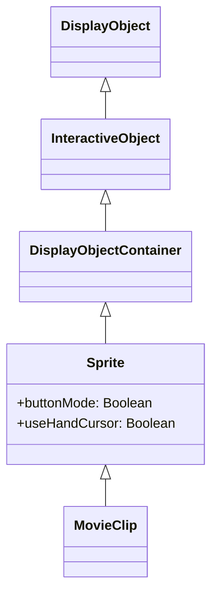
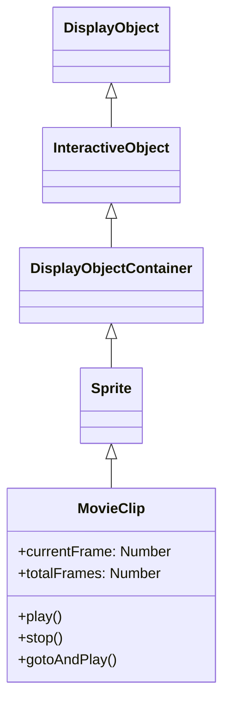
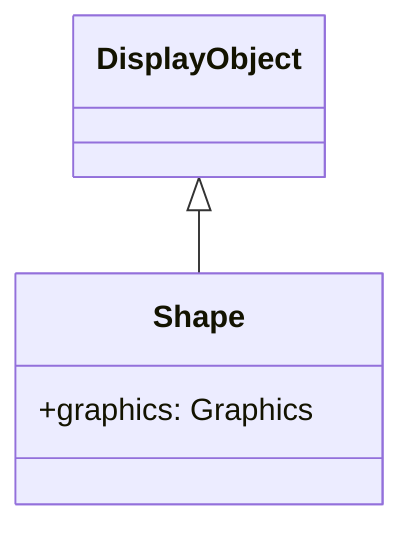

# Next2D Player - 表示オブジェクト（DisplayObject / Sprite / MovieClip / Shape）

---

# DisplayObject

DisplayObjectは、Next2D Playerにおける全ての表示オブジェクトの基底クラスです。

## クラス階層

```
DisplayObject (基底クラス)
├── InteractiveObject
│   ├── DisplayObjectContainer
│   │   └── Sprite
│   │       └── MovieClip    ← addChild() 可能、タイムラインアニメーション
│   └── TextField            ← addChild() 不可、テキスト表示/入力
├── Shape                    ← addChild() 不可、軽量ベクター描画専用
└── Video                    ← addChild() 不可、動画再生専用
```

## プロパティ

### 読み取り専用プロパティ

| プロパティ | 型 | 説明 |
|-----------|------|------|
| `instanceId` | number | DisplayObjectのユニークなインスタンスID |
| `isSprite` | boolean | Spriteの機能を所持しているかを返却 |
| `isInteractive` | boolean | InteractiveObjectの機能を所持しているかを返却 |
| `isContainerEnabled` | boolean | コンテナの機能を所持しているかを返却 |
| `isTimelineEnabled` | boolean | MovieClipの機能を所持しているかを返却 |
| `isShape` | boolean | Shapeの機能を所持しているかを返却 |
| `isVideo` | boolean | Videoの機能を所持しているかを返却 |
| `isText` | boolean | Textの機能を所持しているかを返却 |
| `concatenatedMatrix` | Matrix | ルートレベルまでの結合された変換行列 |
| `namespace` | string | クラスの空間名（例: `"next2d.display.Sprite"`）を返却。クラス判定に使用する |

### 読み書きプロパティ

| プロパティ | 型 | 説明 |
|-----------|------|------|
| `name` | string | 名前。getChildByName()で使用される（デフォルト: ""） |
| `alpha` | number | アルファ透明度値（0.0～1.0、デフォルト: 1.0） |
| `blendMode` | string | 使用するブレンドモード（デフォルト: BlendMode.NORMAL） |
| `filters` | Array \| null | 表示オブジェクトに関連付けられている各フィルターオブジェクトの配列 |
| `height` | number | 表示オブジェクトの高さ（ピクセル単位） |
| `width` | number | 表示オブジェクトの幅（ピクセル単位） |
| `colorTransform` | ColorTransform | 表示オブジェクトのColorTransform |
| `matrix` | Matrix | 表示オブジェクトのMatrix |
| `rotation` | number | DisplayObjectインスタンスの回転角度（度単位） |
| `scaleX` | number | 基準点から適用されるオブジェクトの水平スケール値 |
| `scaleY` | number | 基準点から適用されるオブジェクトの垂直スケール値 |
| `visible` | boolean | 表示オブジェクトが可視かどうか（デフォルト: true） |
| `x` | number | 親DisplayObjectContainerのローカル座標を基準にしたX座標 |
| `y` | number | 親DisplayObjectContainerのローカル座標を基準にしたY座標 |
| `cacheAsBitmap` | Matrix \| null | ベクター描画やコンテナをビットマップとしてキャッシュするMatrix（nullで解除、Videoには適用不可） |

## メソッド

| メソッド | 戻り値 | 説明 |
|---------|--------|------|
| `getBounds(targetDisplayObject)` | Rectangle | 指定したDisplayObjectの座標系を基準にして、表示オブジェクトの領域を定義する矩形を返す |
| `globalToLocal(point)` | Point | pointオブジェクトをステージ（グローバル）座標から表示オブジェクトの（ローカル）座標に変換 |
| `localToGlobal(point)` | Point | pointオブジェクトを表示オブジェクトの（ローカル）座標からステージ（グローバル）座標に変換 |
| `hitTestObject(targetDisplayObject)` | boolean | DisplayObjectの描画範囲を評価して、重複または交差するかどうかを調べる |
| `hitTestPoint(x, y, shapeFlag)` | boolean | 表示オブジェクトを評価して、x および y パラメーターで指定されたポイントと重複または交差するかどうかを調べる |
| `getLocalVariable(key)` | any | クラスのローカル変数空間から値を取得 |
| `setLocalVariable(key, value)` | void | クラスのローカル変数空間へ値を保存 |
| `hasLocalVariable(key)` | boolean | クラスのローカル変数空間に値があるかどうかを判断 |
| `deleteLocalVariable(key)` | void | クラスのローカル変数空間の値を削除 |
| `getGlobalVariable(key)` | any | グローバル変数空間から値を取得 |
| `setGlobalVariable(key, value)` | void | グローバル変数空間へ値を保存 |
| `hasGlobalVariable(key)` | boolean | グローバル変数空間に値があるかどうかを判断 |
| `deleteGlobalVariable(key)` | void | グローバル変数空間の値を削除 |
| `clearGlobalVariable()` | void | グローバル変数空間の値を全てクリア |
| `remove()` | void | 親子関係を解除 |

## ブレンドモード

| 定数 | 説明 |
|------|------|
| `BlendMode.NORMAL` | 通常表示 |
| `BlendMode.ADD` | 加算 |
| `BlendMode.MULTIPLY` | 乗算 |
| `BlendMode.SCREEN` | スクリーン |
| `BlendMode.DARKEN` | 暗くする |
| `BlendMode.LIGHTEN` | 明るくする |
| `BlendMode.DIFFERENCE` | 差分 |
| `BlendMode.OVERLAY` | オーバーレイ |
| `BlendMode.HARDLIGHT` | ハードライト |
| `BlendMode.INVERT` | 反転 |
| `BlendMode.ALPHA` | アルファ |
| `BlendMode.ERASE` | 消去 |

## cacheAsBitmapの使い方

`cacheAsBitmap`はベクター描画やコンテナをビットマップとしてキャッシュし、2回目以降の描画でキャッシュを再利用することでパフォーマンスを向上させるプロパティです。

**適用対象クラス:** `Shape` / `TextField` / `Sprite` / `MovieClip`（`Video`には適用不可）

**Matrixの制限:** スケール値（a, d）のみ設定できます。回転（b, c）や移動（tx, ty）は無視されます。

```typescript
// ✅ 正しい使い方（スケールのみ設定）
shape.cacheAsBitmap = new Matrix(1, 0, 0, 1, 0, 0);  // 等倍
shape.cacheAsBitmap = new Matrix(2, 0, 0, 2, 0, 0);  // 2倍品質

// キャッシュを解除
shape.cacheAsBitmap = null;
```

**キャッシュの動作:**
- 先祖や自身のスケールが変更されるとキャッシュが無効化され、次フレームで再生成
- 位置（x, y）の変更ではキャッシュは維持され、描画位置のみ更新
- `filter`と`cacheAsBitmap`を同時に設定した場合、`cacheAsBitmap`が優先

## クラス判定（namespace）

クラスの種類を判定する際に `constructor.name` を使用してはいけません。プロダクションビルドでは minify によってクラス名が変わるためです。

代わりに `namespace` プロパティを使用します。

```typescript
const { Stage, Sprite } = next2d.display;

// ❌ NG: minify でクラス名が変わるため、ビルド後に判定が壊れる
if (displayObject.constructor.name === "Stage") { /* ... */ }

// ✅ OK: インスタンスの namespace で判定
if (displayObject.namespace === "next2d.display.Stage") { /* ... */ }

// ✅ OK: static の namespace と比較するとタイポも防げる
if (displayObject.namespace === Stage.namespace) { /* ... */ }

// ✅ OK: isStage フラグも使用可能（Stage のみが持つ readonly プロパティ）
if (displayObject.isStage) { /* ... */ }
```

**namespace を持つ主なクラス:**

| クラス | namespace の値 |
|--------|----------------|
| `Stage` | `"next2d.display.Stage"` |
| `Sprite` | `"next2d.display.Sprite"` |
| `MovieClip` | `"next2d.display.MovieClip"` |
| `Shape` | `"next2d.display.Shape"` |
| `Loader` | `"next2d.display.Loader"` |
| `TextField` | `"next2d.display.TextField"` |
| `Video` | `"next2d.media.Video"` |

**補足:** 継承を含めた機能判定には `isStage` / `isSprite` / `isShape` / `isText` / `isVideo` / `isContainerEnabled` / `isTimelineEnabled` の各フラグを使用します。`namespace` は完全一致のクラス判定に使用します。

---

# Sprite

SpriteはDisplayObjectContainerです。MovieClipの基底クラスであり、タイムラインを持たない動的なオブジェクト管理に使用します。

## 継承関係



## プロパティ

### Sprite固有のプロパティ

| プロパティ | 型 | デフォルト | 説明 |
|-----------|------|------------|------|
| `isSprite` | boolean | true | Spriteの機能を所持しているかを返却 |
| `buttonMode` | boolean | false | このスプライトのボタンモードを指定します |
| `useHandCursor` | boolean | true | buttonModeがtrueの場合にハンドカーソルを表示するかどうか |
| `hitArea` | Sprite \| null | null | スプライトのヒット領域となる別のスプライトを指定します |

## メソッド

| メソッド | 戻り値 | 説明 |
|---------|--------|------|
| `startDrag(lockCenter?, bounds?)` | void | 指定されたスプライトをユーザーがドラッグできるようにします |
| `stopDrag()` | void | startDrag()メソッドを終了します |
| `addChild(child)` | DisplayObject | 子DisplayObjectインスタンスを追加します |
| `addChildAt(child, index)` | DisplayObject | 指定のインデックス位置に子DisplayObjectインスタンスを追加します |
| `removeChild(child)` | void | 指定のchild DisplayObjectインスタンスを削除します |
| `removeChildAt(index)` | void | 指定のインデックス位置から子DisplayObjectを削除します |
| `removeChildren(...indexes)` | void | 配列で指定されたインデックスの子をコンテナから削除します |
| `getChildAt(index)` | DisplayObject \| null | 指定のインデックス位置にある子表示オブジェクトインスタンスを返します |
| `getChildByName(name)` | DisplayObject \| null | 指定された名前に一致する子表示オブジェクトを返します |
| `getChildIndex(child)` | number | 子DisplayObjectインスタンスのインデックス位置を返します |
| `setChildIndex(child, index)` | void | 表示オブジェクトコンテナの既存の子の位置を変更します |
| `contains(child)` | boolean | 指定されたDisplayObjectがインスタンスの子孫であるかどうか |
| `swapChildren(child1, child2)` | void | 指定された2つの子オブジェクトのz順序を入れ替えます |
| `swapChildrenAt(index1, index2)` | void | 指定されたインデックス位置の2つの子オブジェクトのz順序を入れ替えます |

## 使用例

### ボタンとして使用

```typescript
const { Sprite, Shape } = next2d.display;
const { PointerEvent } = next2d.events;

const button = new Sprite();
button.buttonMode = true;
button.useHandCursor = true;

const bg = new Shape();
bg.graphics.beginFill(0x3498db);
bg.graphics.drawRoundRect(0, 0, 120, 40, 8, 8);
bg.graphics.endFill();
button.addChild(bg);

button.addEventListener(PointerEvent.POINTER_DOWN, () => {
    console.log("ボタンがクリックされました");
});

stage.addChild(button);
```

### マスクとして使用

```typescript
const { Sprite, Shape } = next2d.display;

const container = new Sprite();
const content = new Shape();
content.graphics.beginFill(0xFF0000);
content.graphics.drawRect(0, 0, 200, 200);
content.graphics.endFill();
container.addChild(content);

const maskShape = new Shape();
maskShape.graphics.beginFill(0xFFFFFF);
maskShape.graphics.drawCircle(100, 100, 50);
maskShape.graphics.endFill();

container.mask = maskShape;
stage.addChild(container);
stage.addChild(maskShape);
```

### ドラッグ＆ドロップ

```typescript
const { Sprite, Shape } = next2d.display;
const { PointerEvent } = next2d.events;
const { Rectangle } = next2d.geom;

const draggable = new Sprite();
const bg = new Shape();
bg.graphics.beginFill(0x3498db);
bg.graphics.drawRect(0, 0, 100, 100);
bg.graphics.endFill();
draggable.addChild(bg);

draggable.addEventListener(PointerEvent.POINTER_DOWN, () => {
    draggable.startDrag(true, new Rectangle(0, 0, 400, 300));
});

draggable.addEventListener(PointerEvent.POINTER_UP, () => {
    draggable.stopDrag();
});

stage.addChild(draggable);
```

---

# MovieClip

MovieClipは、タイムラインアニメーションを持つDisplayObjectContainerです。Open Animation Toolで作成したアニメーションはMovieClipとして再生されます。

## 継承関係



## プロパティ

| プロパティ | 型 | 説明 |
|-----------|------|------|
| `currentFrame` | `number` | MovieClipのタイムライン内の再生ヘッドが置かれているフレームの番号（1から開始、読み取り専用） |
| `totalFrames` | `number` | MovieClipインスタンス内のフレーム総数（読み取り専用） |
| `currentFrameLabel` | `FrameLabel \| null` | MovieClipインスタンスのタイムライン内の現在のフレームにあるラベル（読み取り専用） |
| `currentLabels` | `FrameLabel[] \| null` | 現在のシーンのFrameLabelオブジェクトの配列を返す（読み取り専用） |
| `isPlaying` | `boolean` | ムービークリップが現在再生されているかどうかを示すブール値（読み取り専用） |
| `isTimelineEnabled` | `boolean` | MovieClipの機能を所持しているかを返却（読み取り専用） |

## メソッド

| メソッド | 戻り値 | 説明 |
|---------|--------|------|
| `play()` | `void` | ムービークリップのタイムライン内で再生ヘッドを移動する |
| `stop()` | `void` | ムービークリップ内の再生ヘッドを停止する |
| `gotoAndPlay(frame: string \| number)` | `void` | 指定されたフレームで再生を開始する |
| `gotoAndStop(frame: string \| number)` | `void` | 指定されたフレームに再生ヘッドを送り、そこで停止させる |
| `nextFrame()` | `void` | 次のフレームに再生ヘッドを送り、停止する |
| `prevFrame()` | `void` | 直前のフレームに再生ヘッドを戻し、停止する |
| `addFrameLabel(frame_label: FrameLabel)` | `void` | タイムラインに対して動的にLabelを追加する |

## 使用例

### 基本的なアニメーション制御

```typescript
const { Loader } = next2d.display;
const { PointerEvent } = next2d.events;
const { URLRequest } = next2d.net;

const loader = new Loader();
await loader.load(new URLRequest("animation.json"));

const mc = loader.content;
stage.addChild(mc);

mc.stop();

button.addEventListener(PointerEvent.POINTER_DOWN, () => {
    if (mc.isPlaying) {
        mc.stop();
    } else {
        mc.play();
    }
});
```

### フレームラベルを使った制御

```typescript
mc.gotoAndStop("idle");

function changeState(state) {
    switch (state) {
        case "idle":   mc.gotoAndPlay("idle"); break;
        case "walk":   mc.gotoAndPlay("walk_start"); break;
        case "attack": mc.gotoAndPlay("attack"); break;
    }
}
```

### ネストしたMovieClipの制御

```typescript
const childMc = mc.getChildByName("character");
childMc.gotoAndPlay("run");
```

### フレームラベルの動的追加

```typescript
const { FrameLabel } = next2d.display;

const label = new FrameLabel("myLabel", 10);
mc.addFrameLabel(label);
mc.gotoAndPlay("myLabel");
```

---

# Shape

Shapeは、ベクターグラフィックスの描画専用クラスです。Spriteと異なり子オブジェクトを持てませんが、軽量でパフォーマンスに優れています。

## 継承関係



## プロパティ

| プロパティ | 型 | 説明 |
|-----------|------|------|
| `graphics` | Graphics | この Shape オブジェクトに描画されるベクターの描画コマンドを保持する Graphics オブジェクト（読み取り専用） |
| `isShape` | boolean | Shapeの機能を所持しているかを返却（読み取り専用） |
| `cacheKey` | number | ビルドされたキャッシュキー |
| `cacheParams` | number[] | キャッシュのビルドに利用されるパラメータ（読み取り専用） |
| `isBitmap` | boolean | ビットマップ描画の判定フラグ |
| `src` | string | 指定されたパスから画像を読み込み、Graphicsを生成する |
| `bitmapData` | BitmapData | ビットマップデータを返却（読み取り専用） |
| `namespace` | string | 指定されたオブジェクトの空間名を返却（読み取り専用） |

## メソッド

| メソッド | 戻り値 | 説明 |
|---------|--------|------|
| `load(url: string)` | Promise\<void\> | 指定されたURLから画像を非同期で読み込み、Graphicsを生成する |
| `clearBitmapBuffer()` | void | ビットマップデータを解放する |
| `setBitmapBuffer(width, height, buffer)` | void | RGBAの画像データを設定する |

## SpriteとShapeの違い

| 特徴 | Shape | Sprite |
|------|-------|--------|
| 子オブジェクト | 持てない | 持てる |
| インタラクション | なし | クリック等可能 |
| パフォーマンス | 軽量 | やや重い |
| 用途 | 静的な背景、装飾 | ボタン、コンテナ |

**型制約の注意:**
- `Shape` は `DisplayObjectContainer` を継承しない → `addChild()` 不可
- `Shape` と `Sprite` は直接キャスト不可 → `as unknown as Sprite` の二段階アサーションが必要
- `hitArea` プロパティの型は `Sprite | null` → `Shape` を渡す場合は型アサーション必須

## 使用例

### 基本的な描画

```typescript
const { Shape } = next2d.display;

const shape = new Shape();

shape.graphics.beginFill(0x3498db);
shape.graphics.drawRect(0, 0, 150, 100);
shape.graphics.endFill();

stage.addChild(shape);
```

### 複合図形の描画

```typescript
const { Shape } = next2d.display;

const shape = new Shape();
const g = shape.graphics;

g.beginFill(0xecf0f1);
g.drawRoundRect(0, 0, 200, 150, 10, 10);
g.endFill();

g.lineStyle(2, 0x2c3e50);
g.drawRoundRect(0, 0, 200, 150, 10, 10);

g.beginFill(0xe74c3c);
g.drawCircle(100, 75, 30);
g.endFill();

stage.addChild(shape);
```

### グラデーション背景

```typescript
const { Shape } = next2d.display;
const { Matrix } = next2d.geom;

const shape = new Shape();
const g = shape.graphics;

const matrix = new Matrix();
matrix.createGradientBox(
    stage.stageWidth,
    stage.stageHeight,
    Math.PI / 2,
    0, 0
);

g.beginGradientFill(
    "radial",
    [0x667eea, 0x764ba2],
    [1, 1],
    [0, 255],
    matrix
);
g.drawRect(0, 0, stage.stageWidth, stage.stageHeight);
g.endFill();

stage.addChildAt(shape, 0);
```

## パフォーマンスのヒント

1. **静的な描画にはShapeを使用**: インタラクションが不要な背景や装飾にはShapeが最適
2. **描画の最小化**: 頻繁に変更されない場合は一度だけ描画
3. **clear()の使用**: 動的な再描画時は必ずclear()を呼ぶ
4. **複雑な図形はキャッシュ**: cacheAsBitmapプロパティで描画をキャッシュ

```typescript
const { Matrix } = next2d.geom;
shape.cacheAsBitmap = new Matrix(1, 0, 0, 1, 0, 0);
```

### graphicsのパスキャッシュ

Shapeの`graphics`は**パス情報をもとにキャッシュキーを生成**します。そのため、`new Shape()`しても同じgraphics情報（パス情報）を持つShapeはキャッシュから描画されます。

```typescript
// 同じパス情報 → キャッシュが再利用される（GPU負荷なし）
const shape1 = new Shape();
shape1.graphics.beginFill(0xFF0000).drawCircle(0, 0, 50).endFill();

const shape2 = new Shape();
shape2.graphics.beginFill(0xFF0000).drawCircle(0, 0, 50).endFill(); // キャッシュヒット
```

**キャッシュが有効なプロパティ変更:**

色・透明度・x/y座標・回転（`alpha`, `x`, `y`, `rotation`）はキャッシュを再利用したまま変更できるため、描画負荷が非常に小さくなります。

```typescript
// これらはキャッシュを維持したまま変更可能（低負荷）
shape.alpha = 0.5;
shape.x = 100;
shape.y = 200;
shape.rotation = 45;
```

**scaleがある場合のキャッシュ戦略:**

`scaleX` / `scaleY` を使用する場合は、**最終的に表示される最大サイズで`cacheAsBitmap`を設定**し、そのキャッシュをscaleで縮小表示することで描画負荷を抑えられます。

```typescript
const { Shape } = next2d.display;
const { Matrix } = next2d.geom;

const shape = new Shape();
shape.graphics.beginFill(0x3498db).drawRect(0, 0, 100, 100).endFill();

// 最大サイズ（2倍）でキャッシュしてscaleで調整
shape.cacheAsBitmap = new Matrix(2, 0, 0, 2, 0, 0); // 2倍品質でキャッシュ
shape.scaleX = 0.5; // キャッシュを縮小して表示（描画負荷なし）
shape.scaleY = 0.5;
```

---

# Graphics クラス

Graphicsクラスは、ベクターグラフィックスを描画するための描画APIを提供します。Shape.graphicsプロパティを通じてアクセスします。

## 塗りつぶしメソッド

| メソッド | 説明 |
|---------|------|
| `beginFill(color: number, alpha?: number)` | 単色の塗りつぶしを開始。alphaのデフォルトは1 |
| `beginGradientFill(type, colors, alphas, ratios, matrix?, spreadMethod?, interpolationMethod?, focalPointRatio?)` | グラデーション塗りつぶしを開始 |
| `beginBitmapFill(bitmapData, matrix?, repeat?, smooth?)` | ビットマップ塗りつぶしを開始 |
| `endFill()` | 塗りつぶしを終了 |

## 線スタイルメソッド

| メソッド | 説明 |
|---------|------|
| `lineStyle(thickness?, color?, alpha?, pixelHinting?, scaleMode?, caps?, joints?, miterLimit?)` | 線のスタイルを設定 |
| `lineGradientStyle(type, colors, alphas, ratios, matrix?, ...)` | グラデーション線スタイルを設定 |
| `lineBitmapStyle(bitmapData, matrix?, repeat?, smooth?)` | ビットマップ線スタイルを設定 |
| `endLine()` | 線スタイルを終了 |

## パスメソッド

| メソッド | 説明 |
|---------|------|
| `moveTo(x: number, y: number)` | 描画位置を移動 |
| `lineTo(x: number, y: number)` | 現在位置から指定座標まで直線を描画 |
| `curveTo(controlX, controlY, anchorX, anchorY)` | 二次ベジェ曲線を描画 |
| `cubicCurveTo(controlX1, controlY1, controlX2, controlY2, anchorX, anchorY)` | 三次ベジェ曲線を描画 |

## 図形メソッド

| メソッド | 説明 |
|---------|------|
| `drawRect(x, y, width, height)` | 矩形を描画 |
| `drawRoundRect(x, y, width, height, ellipseWidth, ellipseHeight?)` | 角丸矩形を描画 |
| `drawCircle(x, y, radius)` | 円を描画 |
| `drawEllipse(x, y, width, height)` | 楕円を描画 |

## ユーティリティメソッド

| メソッド | 説明 |
|---------|------|
| `clear()` | すべての描画コマンドをクリア |
| `clone()` | Graphicsオブジェクトを複製 |
| `copyFrom(source: Graphics)` | 別のGraphicsから描画コマンドをコピー |
