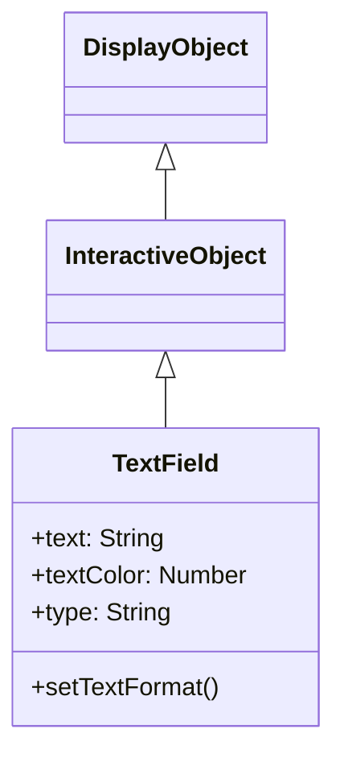
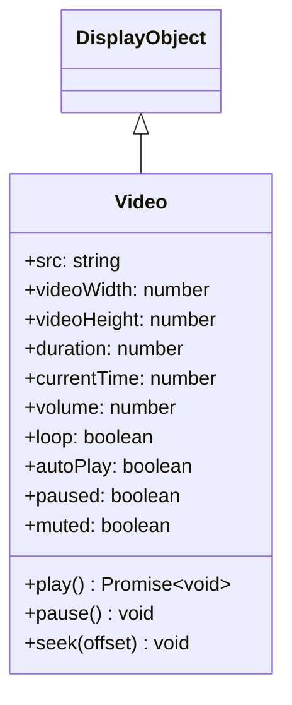

# Next2D Player - メディア・テキスト（TextField / Sound / Video）

---

# TextField

TextFieldは、テキストの表示と編集を行うDisplayObjectです。ラベル表示から入力フォームまで、テキスト関連の機能を提供します。

## 継承関係



## プロパティ

### テキスト関連

| プロパティ | 型 | 説明 |
|-----------|------|------|
| `text` | string | テキストフィールド内の現在のテキスト |
| `htmlText` | string | テキストフィールドの内容をHTMLで表した文字列 |
| `length` | number | テキストフィールド内の文字数（読み取り専用） |
| `maxChars` | number | ユーザーが入力できる最大文字数（0で無制限） |
| `restrict` | string | ユーザーがテキストフィールドに入力できる文字のセットを指定 |
| `defaultTextFormat` | TextFormat | テキストに適用するデフォルトのフォーマット |
| `stopIndex` | number | テキストの任意の表示終了位置の設定（デフォルト: -1） |

### 表示関連

| プロパティ | 型 | 説明 |
|-----------|------|------|
| `width` | number | 表示オブジェクトの幅（ピクセル単位） |
| `height` | number | 表示オブジェクトの高さ（ピクセル単位） |
| `textWidth` | number | テキストの幅（ピクセル単位、読み取り専用） |
| `textHeight` | number | テキストの高さ（ピクセル単位、読み取り専用） |
| `autoSize` | string | テキストフィールドの自動的な拡大/縮小および整列を制御（"none", "left", "center", "right"） |
| `autoFontSize` | boolean | テキストサイズの自動的な拡大/縮小および整列を制御（デフォルト: false） |
| `wordWrap` | boolean | テキストフィールドのテキストを折り返すかどうか（デフォルト: false） |
| `multiline` | boolean | 複数行テキストフィールドであるかどうか（デフォルト: false） |
| `numLines` | number | テキストの行数（読み取り専用） |

### 境界線・背景関連

| プロパティ | 型 | 説明 |
|-----------|------|------|
| `background` | boolean | テキストフィールドに背景の塗りつぶしがあるかどうか（デフォルト: false） |
| `backgroundColor` | number | テキストフィールドの背景の色（デフォルト: 0xffffff） |
| `border` | boolean | テキストフィールドに境界線があるかどうか（デフォルト: false） |
| `borderColor` | number | テキストフィールドの境界線の色（デフォルト: 0x000000） |

### 輪郭関連

| プロパティ | 型 | 説明 |
|-----------|------|------|
| `thickness` | number | 輪郭のテキスト幅。0（デフォルト値）で無効 |
| `thicknessColor` | number | 輪郭のテキストの色（16進数形式、デフォルト: 0） |

### 入力関連

| プロパティ | 型 | 説明 |
|-----------|------|------|
| `type` | string | テキストフィールドのタイプ（"static", "dynamic", "input"）（デフォルト: "static"） |
| `focus` | boolean | テキストフィールドがフォーカスを持つかどうか（デフォルト: false） |
| `focusVisible` | boolean | テキストフィールドの点滅線の表示・非表示を制御（デフォルト: false） |

### スクロール関連

| プロパティ | 型 | 説明 |
|-----------|------|------|
| `scrollX` | number | x軸のスクロール位置（デフォルト: 0） |
| `scrollY` | number | y軸のスクロール位置（デフォルト: 0） |
| `scrollEnabled` | boolean | スクロール機能のON/OFFの制御（デフォルト: true） |

### DisplayObjectから継承

| プロパティ | 型 | 説明 |
|-----------|------|------|
| `cacheAsBitmap` | Matrix \| null | テキスト描画をビットマップとしてキャッシュするMatrix（nullで解除） |

## メソッド

| メソッド | 戻り値 | 説明 |
|---------|--------|------|
| `appendText(newText: string)` | void | 指定されたストリングをテキストフィールドのテキストの最後に付加します |
| `insertText(newText: string)` | void | テキストフィールドのフォーカス位置にテキストを追加します |
| `deleteText()` | void | テキストフィールドの選択範囲を削除します |
| `getLineText(lineIndex: number)` | string | 指定された行のテキストを返します |
| `replaceText(newText: string, beginIndex: number, endIndex: number)` | void | 指定された文字範囲を新しいテキストの内容に置き換えます |
| `selectAll()` | void | テキストフィールドのすべてのテキストを選択します |

## TextFormat

テキストのスタイルを設定するクラスです。

| プロパティ | 型 | 説明 |
|-----------|------|------|
| `font` | String | フォント名 |
| `size` | Number | フォントサイズ |
| `color` | Number | テキスト色 |
| `bold` | Boolean | 太字 |
| `italic` | Boolean | 斜体 |
| `align` | String | 配置（"left", "center", "right"） |
| `leading` | Number | 行間（ピクセル） |
| `letterSpacing` | Number | 文字間隔（ピクセル） |

## 使用例

### 基本的なテキスト表示

```typescript
const { TextField } = next2d.text;

const textField = new TextField();
textField.text = "Hello, Next2D!";
textField.x = 100;
textField.y = 100;

stage.addChild(textField);
```

### TextFormatの適用

```typescript
const { TextField, TextFormat } = next2d.text;

const textField = new TextField();
textField.text = "スタイル付きテキスト";

const format = new TextFormat();
format.font = "Arial";
format.size = 24;
format.color = 0x3498db;
format.bold = true;

textField.setTextFormat(format);
textField.defaultTextFormat = format;

stage.addChild(textField);
```

### 入力フィールド

```typescript
const { TextField } = next2d.text;

const inputField = new TextField();
inputField.type = "input";
inputField.width = 200;
inputField.height = 30;
inputField.border = true;
inputField.borderColor = 0xcccccc;
inputField.background = true;
inputField.backgroundColor = 0xffffff;
inputField.restrict = "0-9";  // 数字のみ

inputField.addEventListener("change", (event) => {
    console.log("入力値:", inputField.text);
});

stage.addChild(inputField);
```

### テキストの輪郭効果

```typescript
const { TextField, TextFormat } = next2d.text;

const textField = new TextField();
textField.autoSize = "left";

const format = new TextFormat();
format.font = "Arial";
format.size = 48;
format.color = 0xffffff;
textField.defaultTextFormat = format;

textField.text = "輪郭付きテキスト";
textField.thickness = 2;
textField.thicknessColor = 0x000000;

stage.addChild(textField);
```

### RPGゲーム風台詞アニメーション（stopIndex）

`stopIndex` を使うと、テキストを先頭から順番に表示するタイプライター効果を実現できます。
RPGゲームの台詞ウィンドウのような演出に適しています。
`stopIndex` のデフォルト値は `-1`（全文字を表示）で、`0` にすると文字が非表示になります。

```typescript
const { TextField } = next2d.text;
const { Tween, Job } = next2d.ui;

const textField = new TextField();
textField.width = 300;
textField.height = 80;
textField.multiline = true;
textField.wordWrap = true;
textField.text = "勇者よ、魔王を倒してくれ！世界の命運はそなたにかかっている。";

stage.addChild(textField);

// stopIndex を 0 → text.length まで 5秒かけてアニメーション（0.5秒の遅延あり）
const job = Tween.add(
    textField,
    { stopIndex: 0 },
    { stopIndex: textField.text.length },
    0.5,
    5
);

job.addEventListener(Job.COMPLETE, () => {
    console.log("台詞表示完了");
});

job.start();
```

## イベント

| イベント | 説明 |
|----------|------|
| `change` | テキストが変更されたとき |
| `focus` | フォーカスを得たとき |
| `blur` | フォーカスを失ったとき |
| `keyDown` | キーが押されたとき |
| `keyUp` | キーが離されたとき |

---

# サウンド

Next2D Playerは、ゲームやアプリケーションで必要な音声機能を提供します。BGM、効果音、ボイスなど様々な用途に対応しています。

## Sound

音声ファイルを読み込み再生するクラスです。EventDispatcherを継承しています。

### プロパティ

| プロパティ | 型 | デフォルト | 読み取り専用 | 説明 |
|-----------|------|----------|:------------:|------|
| `audioBuffer` | AudioBuffer \| null | null | - | オーディオバッファ。load()で読み込んだ音声データが格納されます |
| `loopCount` | number | 0 | - | ループ回数の設定。0でループなし、9999で実質無限ループ |
| `volume` | number | 1 | - | ボリューム。範囲は0（無音）〜1（フルボリューム）。SoundMixer.volumeの値を超えることはできません |
| `canLoop` | boolean | - | ○ | サウンドがループするかどうかを示します |

### メソッド

| メソッド | 戻り値 | 説明 |
|---------|--------|------|
| `clone()` | Sound | Soundクラスを複製します。volume、loopCount、audioBufferがコピーされます |
| `load(request: URLRequest)` | Promise\<void\> | 指定したURLから外部MP3ファイルのロードを開始します |
| `play(startTime: number = 0)` | void | サウンドを再生します。既に再生中の場合は何もしません |
| `stop()` | void | チャンネルで再生しているサウンドを停止します |

## 使用例

### 基本的な音声再生

```typescript
const { Sound } = next2d.media;
const { URLRequest } = next2d.net;

const sound = new Sound();
await sound.load(new URLRequest("bgm.mp3"));
sound.play();
```

### BGMのループ再生

```typescript
const { Sound } = next2d.media;
const { URLRequest } = next2d.net;

const bgm = new Sound();
await bgm.load(new URLRequest("bgm/stage1.mp3"));
bgm.volume = 0.7;
bgm.loopCount = 9999;  // 実質無限ループ
bgm.play();
```

### 効果音（同時に複数回鳴らす場合はclone使用）

```typescript
const { Sound } = next2d.media;
const { URLRequest } = next2d.net;

const seJump = new Sound();
await seJump.load(new URLRequest("se/jump.mp3"));

function playSE(sound) {
    const clone = sound.clone();
    clone.play();
}

player.addEventListener("jump", () => {
    playSE(seJump);
});
```

### サウンドマネージャー

```typescript
const { Sound, SoundMixer } = next2d.media;
const { URLRequest } = next2d.net;

class SoundManager {
    constructor() {
        this._sounds = new Map();
        this._bgm = null;
        this._bgmVolume = 0.7;
        this._seVolume = 1.0;
        this._isMuted = false;
    }

    async preload(id, url) {
        const sound = new Sound();
        await sound.load(new URLRequest(url));
        this._sounds.set(id, sound);
    }

    playBGM(id, loops = 9999) {
        this.stopBGM();
        const sound = this._sounds.get(id);
        if (sound) {
            this._bgm = sound.clone();
            this._bgm.volume = this._isMuted ? 0 : this._bgmVolume;
            this._bgm.loopCount = loops;
            this._bgm.play();
        }
    }

    stopBGM() {
        if (this._bgm) {
            this._bgm.stop();
            this._bgm = null;
        }
    }

    playSE(id) {
        const sound = this._sounds.get(id);
        if (sound) {
            const clone = sound.clone();
            clone.volume = this._isMuted ? 0 : this._seVolume;
            clone.play();
        }
    }

    toggleMute() {
        this._isMuted = !this._isMuted;
        if (this._bgm) {
            this._bgm.volume = this._isMuted ? 0 : this._bgmVolume;
        }
        return this._isMuted;
    }
}
```

## SoundMixer

全体のサウンドを制御するクラスです。

```typescript
const { SoundMixer } = next2d.media;

SoundMixer.stopAll();       // 全ての音声を停止
SoundMixer.volume = 0.5;   // 全体の音量を50%
```

## サポートフォーマット

| フォーマット | 拡張子 | 対応状況 |
|--------------|--------|----------|
| MP3 | .mp3 | 推奨 |
| AAC | .m4a, .aac | 対応 |
| Ogg Vorbis | .ogg | ブラウザ依存 |
| WAV | .wav | 対応（ファイルサイズ大） |

## ベストプラクティス

1. **プリロード**: ゲーム開始前に全ての音声をプリロード
2. **フォーマット**: MP3を推奨（互換性と圧縮率のバランス）
3. **効果音**: 短い音声はWAVでも可（レイテンシが低い）
4. **clone使用**: 同じ音を同時に複数回再生する場合はclone()を使用
5. **モバイル対応**: ユーザーインタラクション後に再生開始

---

# Video

Videoは、動画コンテンツを再生するためのDisplayObjectです。WebM、MP4などの動画フォーマットに対応しています。

## 継承関係



## プロパティ

| プロパティ | 型 | デフォルト | 説明 |
|-----------|------|----------|------|
| `src` | string | "" | ビデオコンテンツへのURLを指定します |
| `videoWidth` | number | 0 | ビデオの幅をピクセル単位で指定する整数です |
| `videoHeight` | number | 0 | ビデオの高さをピクセル単位で指定する整数です |
| `duration` | number | 0 | キーフレーム総数（動画の長さ） |
| `currentTime` | number | 0 | 現在のキーフレーム（再生位置） |
| `volume` | number | 1 | ボリュームです。範囲は 0（無音）～ 1（フルボリューム）です |
| `loop` | boolean | false | ビデオをループ再生するかどうかを指定します |
| `autoPlay` | boolean | true | ビデオの自動再生の設定 |
| `smoothing` | boolean | true | ビデオを拡大/縮小する際にスムージング（補間）するかどうかを指定します |
| `paused` | boolean | true | ビデオが一時停止しているかどうかを返します |
| `muted` | boolean | false | ビデオがミュートされているかどうかを返します |
| `loaded` | boolean | false | ビデオが読み込まれているかどうかを返します |
| `ended` | boolean | false | ビデオが終了したかどうかを返します |
| `isVideo` | boolean | true | Videoの機能を所持しているかを返却（読み取り専用） |

## メソッド

| メソッド | 戻り値 | 説明 |
|---------|--------|------|
| `play()` | Promise\<void\> | ビデオファイルを再生します |
| `pause()` | void | ビデオの再生を一時停止します |
| `seek(offset: number)` | void | 指定された位置に最も近いキーフレームをシークします |

## 使用例

### 基本的な動画再生

```typescript
const { Video } = next2d.media;

const video = new Video(640, 360);
video.src = "video.mp4";
video.autoPlay = true;
video.loop = false;
video.smoothing = true;

stage.addChild(video);
```

### 再生コントロール

```typescript
const { Video } = next2d.media;
const { PointerEvent } = next2d.events;

const video = new Video(640, 360);
video.autoPlay = false;
video.src = "video.mp4";
stage.addChild(video);

playButton.addEventListener(PointerEvent.POINTER_DOWN, async () => {
    await video.play();
});

pauseButton.addEventListener(PointerEvent.POINTER_DOWN, () => {
    video.pause();
});

// 10秒進む
forwardButton.addEventListener(PointerEvent.POINTER_DOWN, () => {
    video.seek(video.currentTime + 10);
});
```

### イベントリスニング

```typescript
const { Video } = next2d.media;
const { VideoEvent } = next2d.events;

const video = new Video(640, 360);

video.addEventListener(VideoEvent.PLAY, () => { console.log("再生リクエスト"); });
video.addEventListener(VideoEvent.PLAYING, () => { console.log("再生開始"); });
video.addEventListener(VideoEvent.PAUSE, () => { console.log("一時停止"); });
video.addEventListener(VideoEvent.SEEK, () => { console.log("シーク:", video.currentTime); });

video.src = "video.mp4";
stage.addChild(video);
```

## VideoEvent

| イベント | 説明 |
|----------|------|
| `VideoEvent.PLAY` | 再生がリクエストされた時 |
| `VideoEvent.PLAYING` | 再生が開始された時 |
| `VideoEvent.PAUSE` | 一時停止時 |
| `VideoEvent.SEEK` | シーク時 |

## サポートフォーマット

| フォーマット | 拡張子 | 対応状況 |
|--------------|--------|----------|
| MP4 (H.264) | .mp4 | 推奨 |
| WebM (VP8/VP9) | .webm | 対応 |
| Ogg Theora | .ogv | ブラウザ依存 |

**注意:** `cacheAsBitmap` は Video には適用できません（固定サイズの画像データのため）。
