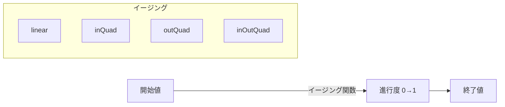

# Next2D Player - Tweenアニメーション

Next2D Playerでは、`@next2d/ui`パッケージのTweenシステムを使用して、プログラムによるアニメーションを実装できます。位置、サイズ、透明度などのプロパティを滑らかに変化させることができます。

---

# Tweenの基本概念



---

# Tween.add()

`Tween.add()`メソッドでアニメーション用の`Job`インスタンスを作成します。

```typescript
const { Tween, Easing } = next2d.ui;

const job = Tween.add(
    target,    // アニメーション対象オブジェクト
    from,      // 開始プロパティ値
    to,        // 終了プロパティ値
    delay,     // 遅延時間（秒、デフォルト: 0）
    duration,  // アニメーション時間（秒、デフォルト: 1）
    ease       // イージング関数（デフォルト: linear）
);

// アニメーションを開始
job.start();
```

## パラメータ

| パラメータ | 型 | デフォルト | 説明 |
|-----------|------|----------|------|
| `target` | any | - | アニメーション対象オブジェクト |
| `from` | object | - | 開始プロパティ値 |
| `to` | object | - | 終了プロパティ値 |
| `delay` | number | 0 | アニメーション開始前の遅延（秒） |
| `duration` | number | 1 | アニメーション継続時間（秒） |
| `ease` | Function \| null | null | イージング関数（デフォルトはlinear） |

---

# Job クラス

Jobクラスは個別のアニメーションジョブを管理します。EventDispatcherを継承しています。

## メソッド

| メソッド | 戻り値 | 説明 |
|---------|--------|------|
| `start()` | void | アニメーションを開始します |
| `stop()` | void | アニメーションを停止します |
| `chain(nextJob: Job \| null)` | Job \| null | このジョブの完了後に別のジョブを連結します |

## プロパティ

| プロパティ | 型 | 説明 |
|-----------|------|------|
| `target` | any | 対象オブジェクト |
| `from` | object | 開始値 |
| `to` | object | 終了値 |
| `delay` | number | 遅延時間 |
| `duration` | number | 継続時間 |
| `ease` | Function | イージング関数 |
| `currentTime` | number | 現在のアニメーション時間 |
| `nextJob` | Job \| null | 次の連結ジョブ |

## イベント

| イベント | 説明 |
|----------|------|
| `enterFrame` | 各アニメーションフレームで発行 |
| `complete` | アニメーション完了時に発行 |

---

# イージング関数

`Easing`クラスは、11種類のイージングタイプでIn、Out、InOutのバリエーションを含む32種類のイージング関数を提供します。

| カテゴリ | 関数 |
|---------|------|
| Linear | `Easing.linear` |
| Quadratic | `Easing.inQuad` / `outQuad` / `inOutQuad` |
| Cubic | `Easing.inCubic` / `outCubic` / `inOutCubic` |
| Quartic | `Easing.inQuart` / `outQuart` / `inOutQuart` |
| Quintic | `Easing.inQuint` / `outQuint` / `inOutQuint` |
| Sinusoidal | `Easing.inSine` / `outSine` / `inOutSine` |
| Exponential | `Easing.inExpo` / `outExpo` / `inOutExpo` |
| Circular | `Easing.inCirc` / `outCirc` / `inOutCirc` |
| Elastic | `Easing.inElastic` / `outElastic` / `inOutElastic` |
| Back | `Easing.inBack` / `outBack` / `inOutBack` |
| Bounce | `Easing.inBounce` / `outBounce` / `inOutBounce` |

---

# 使用例

## 基本的な移動アニメーション

```typescript
const { Tween, Easing } = next2d.ui;

const job = Tween.add(
    sprite,
    { x: 0, y: 100 },
    { x: 400, y: 100 },
    0, 1,
    Easing.outQuad
);

job.start();
```

## 複数プロパティの同時アニメーション

```typescript
const { Tween, Easing } = next2d.ui;

// 移動 + 拡大 + フェードイン
const job = Tween.add(
    sprite,
    { x: 0, y: 0, scaleX: 1, scaleY: 1, alpha: 0 },
    { x: 200, y: 150, scaleX: 2, scaleY: 2, alpha: 1 },
    0, 0.5,
    Easing.outCubic
);

job.start();
```

## アニメーションの連結 (chain)

```typescript
const { Tween, Easing } = next2d.ui;

const job1 = Tween.add(sprite, { x: 0 }, { x: 100 }, 0, 1, Easing.outQuad);
const job2 = Tween.add(sprite, { x: 100 }, { x: 200 }, 0, 1, Easing.inQuad);

job1.chain(job2);
job1.start();
```

## 遅延付きアニメーション

```typescript
const { Tween, Easing } = next2d.ui;

// 0.5秒遅延後に1秒かけてフェードアウト
const job = Tween.add(sprite, { alpha: 1 }, { alpha: 0 }, 0.5, 1, Easing.inQuad);
job.start();
```

## イベントの活用

```typescript
const { Tween, Easing } = next2d.ui;

const job = Tween.add(sprite, { x: 0 }, { x: 300 }, 0, 2, Easing.inOutQuad);

job.addEventListener("enterFrame", (event) => {
    console.log("進行中:", job.currentTime);
});

job.addEventListener("complete", (event) => {
    console.log("アニメーション完了!");
});

job.start();
```

## キャラクタージャンプ

```typescript
const { Tween, Easing } = next2d.ui;

function jump(character) {
    const startY = character.y;
    const jumpHeight = 100;

    const upJob = Tween.add(
        character,
        { y: startY },
        { y: startY - jumpHeight },
        0, 0.3,
        Easing.outQuad
    );

    const downJob = Tween.add(
        character,
        { y: startY - jumpHeight },
        { y: startY },
        0, 0.3,
        Easing.inQuad
    );

    upJob.chain(downJob);
    upJob.start();
}
```

## UI表示アニメーション

```typescript
const { Tween, Easing } = next2d.ui;

function showPopup(popup) {
    popup.scaleX = 0;
    popup.scaleY = 0;
    popup.alpha = 0;

    const job = Tween.add(
        popup,
        { scaleX: 0, scaleY: 0, alpha: 0 },
        { scaleX: 1, scaleY: 1, alpha: 1 },
        0, 0.4,
        Easing.outBack
    );

    job.start();
}

function hidePopup(popup) {
    const job = Tween.add(
        popup,
        { scaleX: 1, scaleY: 1, alpha: 1 },
        { scaleX: 0, scaleY: 0, alpha: 0 },
        0, 0.2,
        Easing.inQuad
    );

    job.addEventListener("complete", () => {
        popup.visible = false;
    });

    job.start();
}
```

## コイン取得エフェクト

```typescript
const { Tween, Easing } = next2d.ui;

function coinCollectEffect(coin) {
    const job = Tween.add(
        coin,
        { y: coin.y, alpha: 1, scaleX: 1, scaleY: 1 },
        { y: coin.y - 50, alpha: 0, scaleX: 0.5, scaleY: 0.5 },
        0, 0.5,
        Easing.outQuad
    );

    job.addEventListener("enterFrame", () => {
        coin.rotation += 15;
    });

    job.addEventListener("complete", () => {
        coin.parent?.removeChild(coin);
    });

    job.start();
}
```
